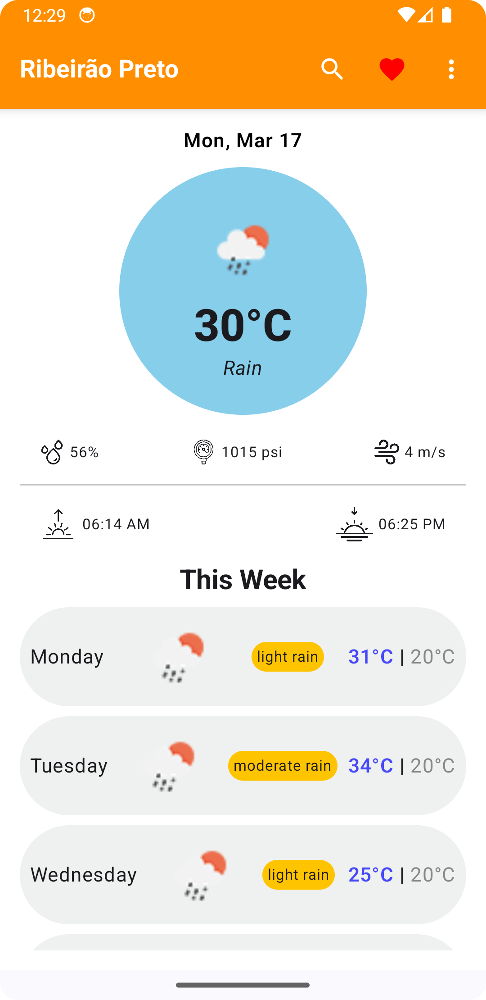
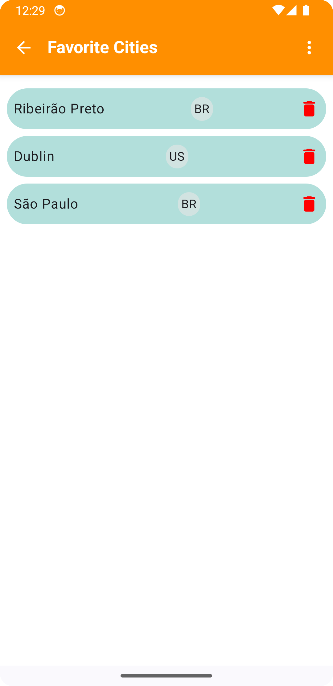
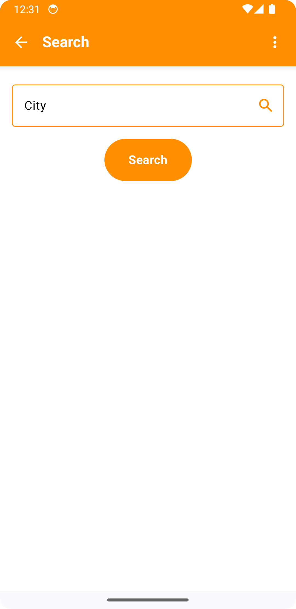
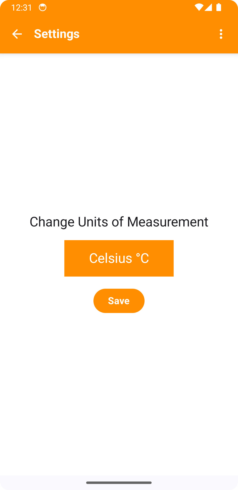

# 🌦️ WeatherApp - Android (Kotlin Compose)

[](https://kotlinlang.org/)
[](https://developer.android.com/jetpack/compose)
[](https://developer.android.com/topic/architecture)
[](https://developer.android.com/training/dependency-injection/hilt-android)

## 🚀 Overview

**WeatherApp** is a modern Android application built using **Kotlin Compose**, following the **MVVM** architecture and **Clean Architecture** principles. The app integrates with the **[OpenWeatherMap API](https://api.openweathermap.org)** to fetch real-time weather data.

## ✨ Features

👉 **Jetpack Compose** for a modern, declarative UI  
👉 **MVVM + Clean Architecture** for scalable and maintainable code  
👉 **Retrofit** for seamless network requests  
👉 **Room** for local database storage  
👉 **Dagger Hilt** for dependency injection  
👉 **Coroutines & Flow** for efficient asynchronous programming  
👉 **Unit & UI Testing** with JUnit, Mockito, and Robolectric  

---

## 🛠️ Tech Stack

| Category            | Technology |
|--------------------|------------|
| **Language**      | Kotlin |
| **UI Framework**  | Jetpack Compose |
| **Architecture**  | MVVM + Clean Architecture |
| **Networking**    | Retrofit |
| **Database**      | Room |
| **Async**        | Coroutines, Flow |
| **Dependency Injection** | Dagger Hilt |
| **Testing**       | JUnit, Mockito, Robolectric |

---

## 🔗 API Integration

This app uses **[OpenWeatherMap API](https://api.openweathermap.org)** to fetch weather data.  
To use the API, you need to obtain a free API key from OpenWeatherMap:

1. Sign up at [OpenWeatherMap](https://home.openweathermap.org/users/sign_up)
2. Get your **API Key** from the dashboard
3. Add the API Key to your project's `local.properties` file:

```properties
API_KEY="your_api_key_here"
```

---

## 🚀 Getting Started

### Prerequisites
- Android Studio **Giraffe | 2023.3.1** or later
- Kotlin **1.9.0+**
- Gradle **8.0+**
- Minimum SDK **24** (Android 7.0+)

### Setup Instructions
1. **Clone the repository**
   ```sh
   git clone https://github.com/felippeneves/kotlin-compose-weather-app.git
   cd WeatherApp
   ```

2. **Open the project in Android Studio**  
   - Sync Gradle files

3. **Add your API Key**  
   Edit `local.properties`:
   ```properties
   API_KEY="your_api_key_here"
   ```

4. **Run the project**
   - Select a device/emulator and press **Run ▶️** in Android Studio.

---

## 🧪 Testing

To run tests, execute:

```sh
./gradlew testDebugUnitTest
```

For UI tests:

```sh
./gradlew connectedAndroidTest
```

---

## 🏗️ Architecture

This project follows **Clean Architecture** principles with modular layers:

- **Presentation Layer**: Jetpack Compose UI, ViewModels  
- **Domain Layer**: Use Cases, Business Logic  
- **Data Layer**: Repositories, API & Database  

📉 **MVVM Pattern** ensures separation of concerns and testability.

---

## 📸 Screenshots

### Home Screen



### Favorite Cities Screen



### Search Screen



### Settings Screen



---

## 📜 License

This project is licensed under the **MIT License** - see the [LICENSE](LICENSE) file for details.

---

## 🤝 Contributing

Want to contribute? Pull requests are welcome!  
For major changes, please open an issue first to discuss the proposal.

---

## 📨 Contact

💬 **Author:** [Felippe Neves](https://github.com/felippeneves)  
📌 **GitHub:** [WeatherApp](https://github.com/felippeneves/kotlin-compose-weather-app)

---

🔹 **Happy Coding! 🚀**


